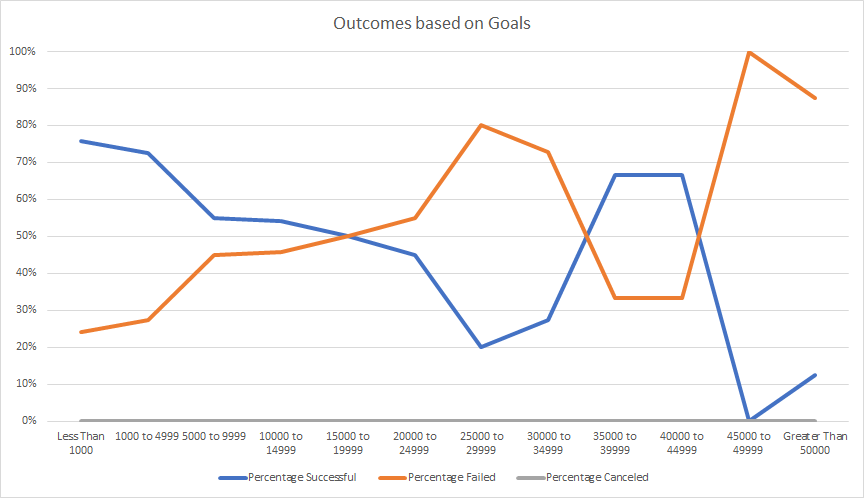
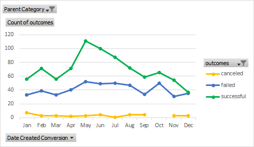

### Challenge

Chart 1 Outcome based on Goals

Chart 2 Outcome based on Launch Date

Analysis

From the chart "Outcomes based on Goals", we see a comparison of the percentage successful play kickstarters to the percentage of failed play kickstarters. It is immediately noted that the two lines mirror each other. This is due to the fact that there were no canceled plays. What is seen from the successful percentage line is that as the goal (y-axis) increases, generally, the percentage of successful plays decreases. There is an exception in the 35,000 to 39,999 and 40,000 to 44,999 range. A trend is shown in the failed line where fails increase as the goal increases. These indicate that goals should be kept on the lower side to increase chance of success. However, this is likely only be due to an higher ease of meeting the lower requirements of the lower goals and not actually reflecting conditions required to meet goals. A possibly better way of looking at goals versus success would be to use it as a guage of difficulty in meeting goals and not as an indicator of whether success would occur from a set goal. Then it would be possible to guage a range Louise can obtain from her Kickstarter. Another factor we need to be careful of is that the graph is based on percentages. If a sample size was not large, it is possible that the data is not representing the information proportionally. It is possible for the 35,000 to 39,999 and 40,000 to 44,999 goals that there were relatively few plays that had that goal, but just so happened to meet them. Thus in addition to this graph, a table of counts would be helpful in determining how the outcomes were affected by goals.

From the chart "Outcomes based on Launch Date", we see a comparison of the launch date of a theater kickstarters to the number of successes and failures. Generally throughout the year, the number of successes and failures are fairly proportional  to each other (rise and fall together) with the exception of 3 months. These months are May, June and December. It appears that successes are significantly higher during the months of May and June, however, successes are significantly lower during December to the point where they are almost on par with failures. Throughout the year canceled Kickstarters remain fairly constant. This indicates that theater based kickstarters tend to do better in May and June and thus Louise may have more success if launching her kickstarter during those two months. On the same note, Louise may also want to avoid launching her Kickstarter during December. One factor that possibly should be looked at would be specifically filtering the data to look at plays. The current chart fills out information for theater based Kickstarters which include musicals and spaces in addition to plays. As Louise is planning on Kickstarting a play, it may be more useful to look at specifically the play subcategory as musicals and spaces may have different attributes that affects how the information is currently viewed.

There are a few limitations with the current set of graphs and tables. In general, the information primarily gives an introduction that higher goals are more likely to fail and that all theater based projects tend to be more successful if launched between May and June. One initial change could be further filtering the "Outcome based on Launch Date Chart" to specifically target the subcategory plays and not just the parent category theater. This will be able to get information that should more closely be similar to Louise’s project. Other tables that we can look into is obtaining information about the central tendencies of successful and failed plays in regards to goal and pledge amounts. In this way we can obtain some insight into the typical amounts that successful plays set as a goal and the typical amounts for pledges that successful plays get and compare it with Louise’s plan. The data can also be further filtered so that all the above information is based on geographic area to match the region the Louise plans to launch her Kickstarter. Another area in the data that can be looked into would be comparing the central tendencies regarding the number of backers of successful Kickstarters to failed Kickstarters. The average donation for those projects with the number of backers would help give another measurement to take into account when planning Louise’s Kickstarter. Lastly, looking at the percentage funded for both successful and failed Kickstarters can also give understanding of possible results from Louise’s planned Kickstarter by describing typically how much a project had successes or failures. These are some ideas that can be further developed.

